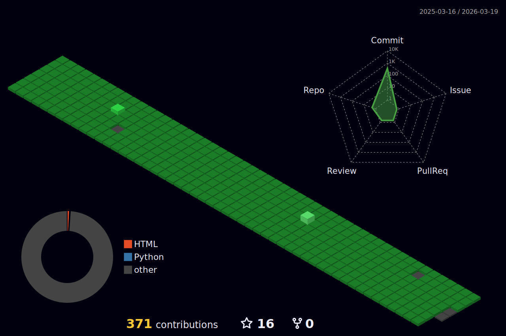

<table width="12000" bordercolor="#0EFF00" bgcolor="#0EFF00">
  <tr>
    <td align="left">Hi Guys~ this is visit counter</td>
    <td align="right">Studying Stack</td>
  </tr>
  <tr>
    <td align="left"></td>
    <td align="right">
        
        
        
        
        
        
      
        
         
        
        
        
        
        
        </td>
  </tr>
 </table>
  

---

---

